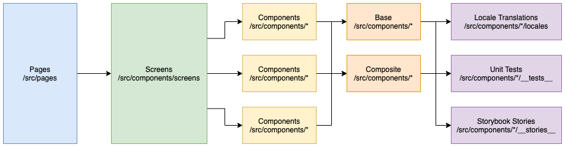

# the Stool Diary

[](https://app.netlify.com/sites/stooldiary/deploys)

The Stool Diary is a web application which allows users to record their stool events. It provides the following features:
- Recording stools
- Seeing historically-recorded stools
- Authentication

## Technical

### Underlying Technologies
The Stool Diary utilizes a number of technologies to create the web application
#### Production

- [Gatsby](https://www.gatsbyjs.com/) as the static-site generator to generate all of the pages including those will later contain dynamic content
- [Firebase](https://firebase.google.com/) Firestore as the storage technology to record user and stool information
- [Firebase](https://firebase.google.com/) Authentication as the authentication technology to manage user accounts
- [MaterialUI](https://material-ui.com/) as the design system to help create the UI components
- [React-i18n](https://react.i18next.com/) to provide localization
- [MomentJs](https://momentjs.com/) to help parse and evaluate dates
- [EmailJS](https://www.emailjs.com/) to send emails from the contact form
- [Netlify](https://www.netlify.com/) for hosting

#### Development
- [Jest](https://jestjs.io/) for unit testing
- [React-testing-library](https://testing-library.com/) for test rendering
- [TestCafe](https://testcafe.io/) for end-to-end testing
- [Storybook](https://storybook.js.org/) for UI component design and development
- [ESLint](https://eslint.org/)/[Prettier](https://prettier.io/) for code formatting
- [Github](https://github.com/) for version control
- Github Actions for integration
### Project Structure

The project structure follows simple but open rules. 
* Pages are composed of screens
* Screens are composed of components
* Components can be base (customizable in place) or composite (specifically-purposed) components
* All components (including screens) can have Locale translations, unit tests, and storybook stories



It enforces this pattern by using a mix of naming and directory conventions.

#### Name conventions

- `<somefile>.js`: (File) Any functional file (both plain JS and React JSX)
- `__<private>__`: (Folder) indicates a private folder not used in production (e.g. `__stories__`, `__tests__`)
- `<component>.test.js`: (File) indicates a unit test file
- `<component>.stories.js`: (File) indicates a Storybook file
- `<user scenario>.e2e.test.js`: (File) indicates an E2E test file
- `<page or screen>.pageobject.js`: (File) indicates a E2E test representation of a page or screen
- `<page>Screen.js`: (File) indicates a Screen component
- - `<somefile>.locale.<languageCode>.js`: (File) indicates translation file for the component in a specific language


#### Directory conventions

- `src/pages`: a folder for the page components (defines the routes of the web app built by Gatsby)
- `src/components/screens`: a folder for a components that combine other components to create a screen
- `src/components/firebase`: a folder for a Firebase functions
- `src/components/i18n`: a folder for a React i18n functions
- `src/components/<component>`: individual folders for a composable components. Components listed at this level are assumed to be base components that can be customized in place where they are used.
- `src/components/<component>/composites`: a folder that for specifically-purposed components
- `src/components/**/locales`: a folder for the individual components translation files by i18n 
- `src/locales`: a generated folder of merged translations at build time used by i18n
- `src/components/**/__stories__`: a folder for component Story file used in Storybook
- `src/components/**/__mocks__`: a folder Jest mocks of components
- `src/images`: a folder for image files
- `src/components/images`: a folder for a Gatsby `` React components that wrap an image file
- `src/utils`: a folder for utility functions and web-app-used resources

### Build
The build process uses the standard Gatsby approach to building applications. 

`gatsby-node.js` has been extended to 
- merge and generate the translation files for i18n

### State
State is managed using a combination of `React.useContext` and `React.useState`

#### useState
`useState` is used for single-component state and often for visual or component-view toggles. It is intended that `useState` is only used for minor and private internal functionality

#### useContext
React Context API is used to maintain user state across components. Contexts are designed with patterns defined by [Kent C. Dodds using React Context effectively](https://kentcdodds.com/blog/how-to-use-react-context-effectively). 

The Contexts align in both the domain model (**stools** and **users**) as well as larger functional scope (**Global**).

Individual contexts are concerned with the domains they are responsible for. 

Global context is concerned with the user session, experience and interaction with the application at a point in time as they use it (e.g. are they logged in? what language do they need? etc.)

### Testing

#### Unit Tests

StoolDiaryWeb uses `jest` and `react-testing-library` for unit testing the React components and agnostic/utility functions.

Test files are co-located next to the file/component under test in a directory named `__tests__` and are appended with _".test."_ in the filename e.g.
- (source) `src/components/form/stool/RecordStoolForm.js`
- (test) `src/components/form/stool/__tests__/RecordStoolForm.test.js`

Individual test names should apply the `when..., then...`; e.g.
```javascript
test(`when the add time toggle is turned on, then the time picker is displayed`,
```

Mock files are contained in both `__mock__` root folder which apply globally as well as individual components

#### E2E Tests

StoolDiaryWeb uses `testcafe` for end-to-end testing (i.e. user simulation testing). Testcafe is configured for the project using `.testcaferc.json` file.

End-to-end (E2E) tests are located in `tests/e2e` directory. Each E2E test file is appended _".e2e.test."_; e.g. `Navigation.e2e.test.js`.

StoolDiaryWeb uses the Page Object Model for E2E testing; every page of the application (with exception to page layout) is a page object located in the `tests/e2e/pageobjects` directory. Each page object is a file appended with _".pageobject."_ , e.g. `HomePage.pageobject.js`, and contains a list of document selectors for that page (preferably `data-testid`). Each page object is a class representing an application page and inherits from the parent `PageObject.js` class which will generate clickable and verifiable testcafe functions based on those selectors defined in the child class.

### Languages

#### How i18n translations are generated:

StoolDiaryWeb uses `react-i18next` to provide text translations. This involves wrapping text with a hook provided by the i18n library.

```javascript
// example

const Component = () => {
  const { t } = useTranslation()

  return <p>{t("I am a translated piece of text")}</p>
}
```

Translations are defined in JSON files with the format of `<component-name>.locale.{language-code}.json`. These are co-located near the components that use the translations (mostly).

During the build process, all translation files are gathered and merged into a single `translation.json` (per language) and minified. This file is what is sent to the client through a network request when loading the page. Each language `translation.json` is copied to `/public/locales/{language code}/` for each defined language.

The build process that gathers and merges these translation files is defined in `gatsby-node.js`

#### How the App changes language

StoolDiaryWeb uses a global React context object to store the web app state including the displayed language. Using the `LanguageSelector` component, it uses the `GlobalContextProvider` (specifically it's State and Dispatch contexts) to update the language currently in use. When this change is made by the selector component, two changes are performed:

1. `i18n.changeLanguage(languageCode)` is called so that `i18n` uses the `translation.json` for the given language
2. The display language is stored in the `GlobalStateContext`.
   The `GlobalContextProvider` wraps all pages in Gatsby (via `gatsby-browser.js`) so that each navigable page retains the global state so that the selector component shows the correct selected language.

### Contact

The contact form at the route `/contact` is able to send emails to a specific administrator/representative that can manage that users request.

The Stool Diary requires a server-side function to create and send the emails which can't be done in the client.

The approach is to use EmailJS as a service-provider to send the emails to the administrators. This involves:
* Calling the EmailJS API with the required information
* Enabling the client application with configuration (identification of the EmailJS user, template, etc). These are defined by the environment variables.

```javascript
 emailjs
    .send(
      process.env.GATSBY_EMAILJS_SERVICE_ID,
      process.env.GATSBY_EMAILJS_CONTACT_FORM_TEMPLATE_ID,
      {
        from_name: name,
        from_email: email,
        subject: subject,
        message: message,
      },
      process.env.GATSBY_EMAILJS_USER_ID
    )
    .then(res => {
      setContactFormStateFn({ status: SUCCESS_STATUS })
    })
    .catch(err => setContactFormStateFn({ status: ERROR_STATUS }))
}
```

### CI/CD
The Stool Diary implements continuous integration and continuous delivery. These are separated by particular service providers.

#### Continuous Integration
Continuous Integration is handled through Github Actions. 

A workflow file is defined in `.github/workflow/ci.js.yml` where it will:
- Install and configure the application
- Format code
- Build the application
- Run the unit tests
- Run the end-to-end tests
  
#### Continuous Delivery
Continuous Delivery is handled through Netfliy

### Environment Variables
The application requires two categories of environment variables:
- Firebase
- EmailJS
A sample is included in the `.env` file and these need to be overridden by:
- `.env.local` for local builds
- Github secrets for CI
- Netlify environment variables for CD and hosted application